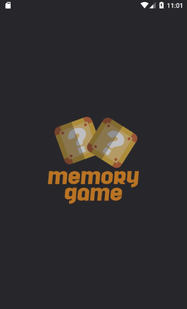
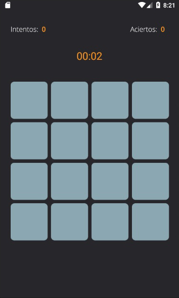
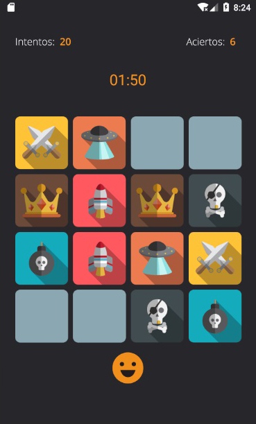
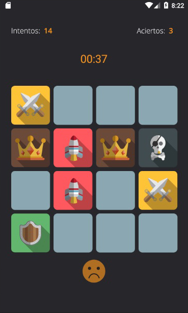

# Memory Game

Memory game programmed in Java in Android Studio. It has 4 columns and 4 rows. The goal is to find each pair of cards, once the game is finished it shows the number of attempts it took to finish it and the time.

## Activities Screenshots
Splash | Main   | Game (successful match)
------ | -----  | ------
 |  | 

Game (wrong match)  | End | 
------              | -----    |
    |  | 

Preview |
------- |

